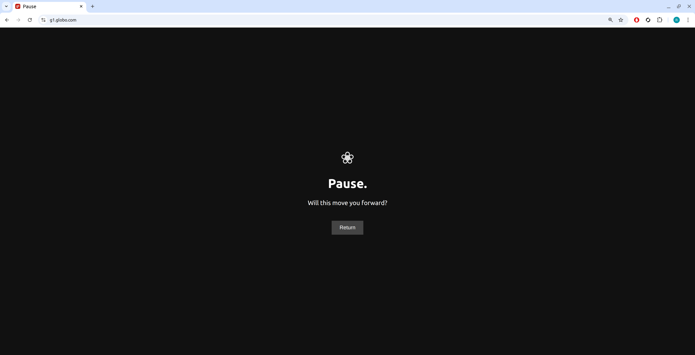
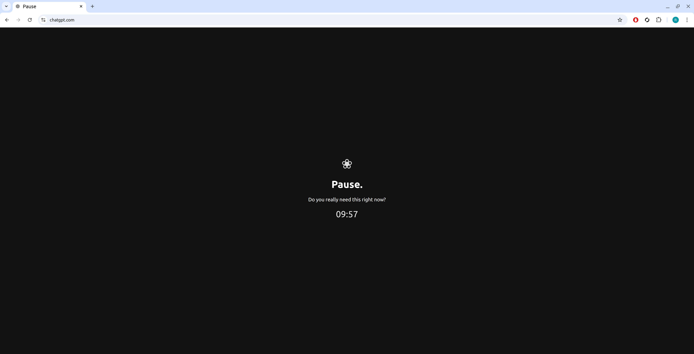

## Healthy Browsing Tampermonkey Scripts

Small Tampermonkey scripts to make browsing more intentional, healthy and wholesome.

Currently included (in `scripts/`):
- `scripts/x-following-only.user.js`: forces the X (Twitter) Home feed to:
  - show **Following** only
  - use **Recent** (chronological, `?f=live`)
  - hide "For you" and the tab header UI
- `scripts/block-sites.js`: hard-blocks a set of distracting news / video / social sites right at `document-start`, replacing them with a simple **"Pause. Will this move you forward?"** page and a **Return** button
- `scripts/friction-timer.js`: adds a **10‑minute delay** before allowing access to selected AI/chat sites (ChatGPT, Claude, Grok, Gemini etc.), then lets you through for a limited time after a deliberate decision
- `scripts/intent-pause.js`: adds an intentionality gate for AI/chat sites by asking you to write a concrete intent before starting or continuing a session

## Install (general)
1. Install Tampermonkey (Chrome)
2. Open the script file you want in your browser:
   - `scripts/x-following-only.user.js`
   - `scripts/block-sites.js`
   - `scripts/friction-timer.js`
   - `scripts/intent-pause.js`
3. Tampermonkey will prompt you to install it

## Script details

### `x-following-only.user.js`
- Forces X Home to **Following only**
- Forces timeline to **Recent (`?f=live`)**
- Hides the "For you" tab and related UI chrome

### `block-sites.js`
- Matches a curated list of news/video / distraction domains (G1, UOL, Folha, Estadão, CNN, BBC, Terra, O Globo, YouTube, 4chan and variants)
- Runs at `document-start` and immediately stops page loading
- Replaces the page with a dark, minimal screen:
  - title: **Pause**
  - question: **"Will this move you forward?"**
  - a single **Return** button that just goes `window.history.back()`
- You can optionally allow specific paths by editing the `allowedPaths` array in the script

### `friction-timer.js`
- Targets AI/chat tools:
  - `chat.openai.com`, `chatgpt.com`, `claude.ai`, `grok.x.ai`, `gemini.google.com`
- On first visit:
  - stops page load at `document-start`
  - shows a **Pause** screen with:
    - question: **"Do you really need this right now?"**
    - a countdown timer for **10 minutes**
    - a **"Really go on"** button that appears only after the timer finishes
- When you click **"Really go on"**:
  - stores an "allowed until" timestamp in `localStorage`
  - reloads the page so you can access the site normally
  - future visits within that window skip the delay

### `intent-pause.js`
- Targets the same AI/chat tools as `friction-timer.js`
- At `document-start`, replaces the page with a dark **Pause** screen
- When no session exists:
  - shows a textarea asking **"What concrete output will exist after this?"**
  - requires a sufficiently specific intent before you can begin
  - stores `{ intent, startedAt }` in `localStorage` under `ai_active_session`, then reloads the site
- When a session is active:
  - shows your saved intent
  - lets you either **Continue** (reload normally) or **End session** (clear `localStorage` and return to the pause screen on next load)

## Notes
- X changes its UI often. If `x-following-only.user.js` breaks, open an issue with screenshots / DOM snippet.
- The target site lists and timings in the scripts are meant as defaults; edit the match rules and constants in each script to suit your own habits.

## Optional Time Guard snippet

You can paste this snippet at the very top of any userscript (right after the `==UserScript==` metadata block) to only allow it during specific weekday time windows (by default, weekday mornings 09:00–12:00 and afternoons 13:30–18:00, never on weekends, using your local browser time).

```js
// === Time Guard ===
(function () {
  const now = new Date();
  const day = now.getDay(); // 0 = Sunday, 6 = Saturday
  const hour = now.getHours();
  const minutes = now.getMinutes();
  const current = hour * 60 + minutes;

  const isWeekend = (day === 0 || day === 6);

  const inMorning = current >= (9 * 60) && current < (12 * 60);
  const inAfternoon = current >= (13 * 60 + 30) && current < (18 * 60);

  const allowed = !isWeekend && (inMorning || inAfternoon);

  if (!allowed) {
    console.log("Script disabled by time guard.");
    return; // Stops the script here
  }
})();
```

- To customize, change the hour ranges in `inMorning` and `inAfternoon`
- If you want weekends partially allowed, adjust the `isWeekend` logic

## Screenshots
### Block Sites


### Friction Timer


### Intent Pause scree


